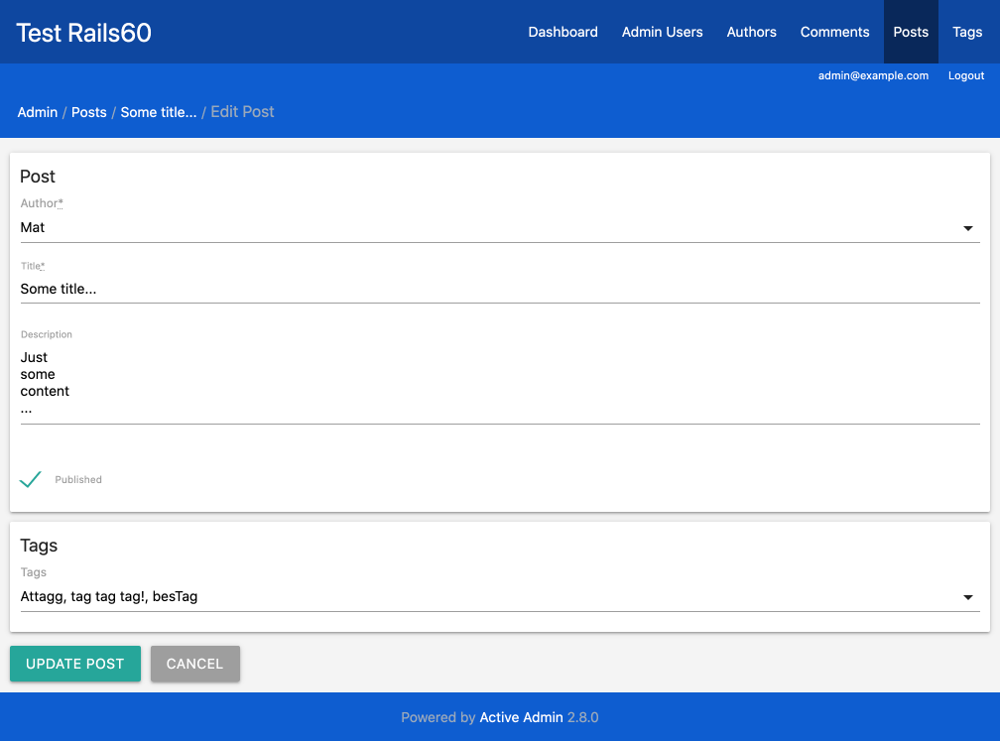
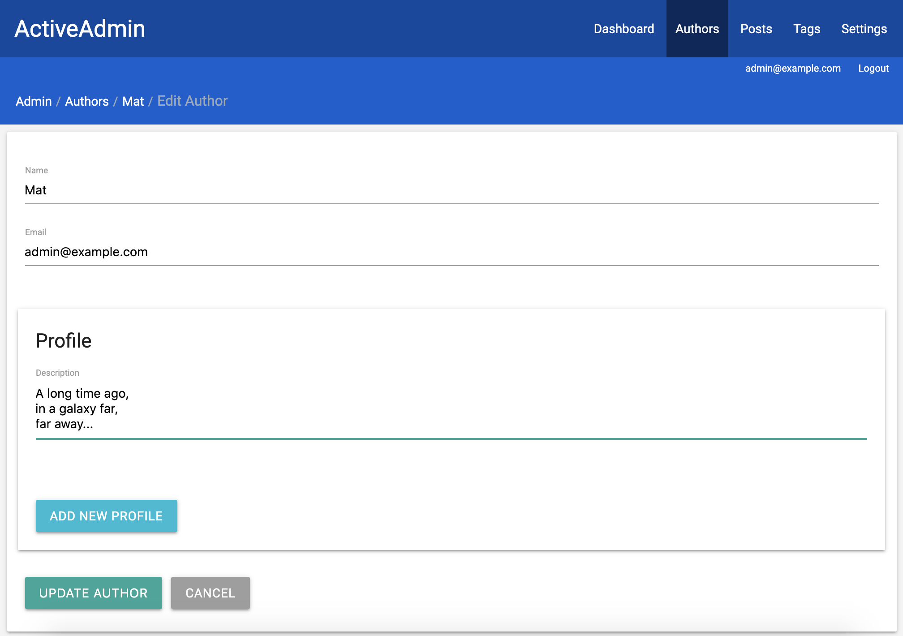

# Active Admin Materialize Theme [](https://badge.fury.io/rb/activeadmin_materialize_theme)
A theme for Active Admin based on Materialize framework.

## Installation
- Add to the Gemfile: `gem 'activeadmin_materialize_theme'` (and execute `bundle`)
- In _app/assets/stylesheets/active_admin.scss_) leave only this import line:
```scss
@import 'activeadmin_materialize_theme/theme';
```
- (optionally) Enable Roboto font:
```scss
@import 'activeadmin_materialize_theme/roboto';
```
- Add at the end of your Active Admin javascripts (_app/assets/javascripts/active_admin.js_):
```js
//= require activeadmin_materialize_theme
```

## Screenshots
Index page (with scopes and filters):


Edit page (with a nested form):


## Do you like it? Star it!
If you use this component just star it. A developer is more motivated to improve a project when there is some interest.

Take a look at [other Active Admin components](https://github.com/blocknotes?utf8=✓&tab=repositories&q=activeadmin&type=source) that I made if you are curious.

## Contributors
[Mattia Roccoberton](http://blocknot.es): author

## License
The gem is available as open source under the terms of the [MIT License](https://opensource.org/licenses/MIT).
